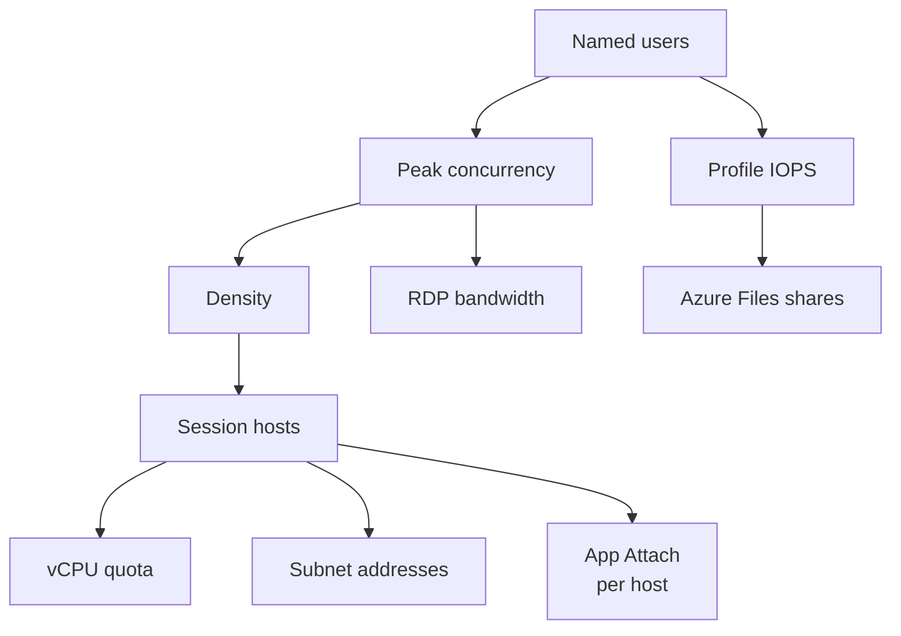

# Sizing estimates

!!! abstract "At a glance"
    - Start with an estimate, then prove it in a pilot. The numbers below are Microsoft-documented starting points, not a replacement for measurement.
    - Size compute, storage, network, platform limits and operations together. A design that has enough session hosts can still fail on profile IOPS, file handles, subnet addresses or vCPU quota.
    - Every design number on this page is quoted from Microsoft Learn and linked to its source.
    - Where Learn gives only examples, this page labels them as examples and shows how to replace them with pilot data.

## In plain terms

Level 100

Sizing is capacity planning. It answers simple questions before users arrive: how many people will connect at the same time, how much work each person does, how many hosts that needs, and whether the storage, network and Azure limits can handle the peak.

Three inputs drive the first estimate: **users**, **peak concurrency** and **workload type**. Users tell you the migration scope. Peak concurrency tells you how many users are active at once. Workload type tells you how much central processing unit (CPU), memory, storage input/output operations per second (IOPS) and network bandwidth each active user is likely to need.

The rule is: **estimate, then measure in a pilot**. Microsoft Learn's figures help you avoid a blank page, but the final number must come from your applications, your image, your profile behaviour and your network.

## What you size

Level 200

Sizing is not only virtual machines. It is a chain. User demand becomes host demand, host demand becomes quota and subnet demand, and the same user count creates profile IOPS, App Attach file handles and network bandwidth.

This flow shows the first-pass sizing model.

1. Start with named users, then estimate peak concurrent users.
2. Choose a workload type and density, then calculate hosts.
3. Add headroom for autoscale maximums and session host update batches.
4. Check vCPU quota and subnet addresses for the maximum number of hosts.
5. Size FSLogix profile storage for sign-in and steady state.
6. Size App Attach per session host, per image.
7. Estimate bandwidth per scenario, then measure real connection quality.

### Compute - session hosts

Compute sizing starts with the workload category. Microsoft documents maximum suggested users per vCPU for multi-session workloads: light 6, medium 4, heavy 2 and power 1 ([Session host virtual machine sizing guidelines](https://learn.microsoft.com/windows-server/remote/remote-desktop-services/session-host-virtual-machine-sizing-guidelines)). Multiply by vCPU count to get an initial sessions-per-host number, then validate with real users.

### Storage - profiles and App Attach

FSLogix profile containers create the sign-in IOPS storm. Microsoft Learn gives an example of 10 IOPS per user at steady state and 50 IOPS per user at sign-in and sign-out ([FSLogix container storage options](https://learn.microsoft.com/fslogix/concepts-container-storage-options)). App Attach is different: the App Attach performance example is **per session host, per image or App-V package**, not per user ([App Attach overview](https://learn.microsoft.com/azure/virtual-desktop/app-attach-overview)).

### Network - bandwidth, latency and addresses

RDP bandwidth changes by scenario. Microsoft gives example per-user bandwidth for a single 1920 x 1080 monitor, ranging from 0.3 Kbps idle to 8.5-9.5 Mbps for video playback in default mode ([RDP bandwidth requirements](https://learn.microsoft.com/azure/virtual-desktop/rdp-bandwidth)). The subnet needs one IP address per session host network interface, and Azure reserves five addresses in every subnet ([Virtual network FAQ](https://learn.microsoft.com/azure/virtual-network/virtual-networks-faq#are-there-any-restrictions-on-using-ip-addresses-within-these-subnets)).

### Platform - quota and service limits

Dynamic autoscaling and session host update create virtual machines. Size regional vCPU quota for the maximum host count, not the minimum. Microsoft says the **Quotas** page lets you view quota and request increases ([View quotas](https://learn.microsoft.com/azure/quotas/view-quotas)). Also check Azure Virtual Desktop service limits, including 10,000 session hosts per host pool ([Azure subscription and service limits](https://learn.microsoft.com/azure/azure-resource-manager/management/azure-subscription-service-limits#azure-virtual-desktop-service-limits)).

### Operations - Log Analytics volume

Azure Virtual Desktop Insights uses Azure Monitor Logs. Microsoft gives example data ingestion values for healthy hosts: performance counters 90-130 MB per VM per day, events 2-15 MB and Azure Virtual Desktop diagnostics less than 1 MB ([Estimate Azure Virtual Desktop monitoring costs](https://learn.microsoft.com/azure/virtual-desktop/insights-costs#estimating-total-costs)). Treat those as examples only.

## The numbers

Level 300

### Session host density by workload

Microsoft Learn says this table lists the *"maximum suggested number of users per virtual central processing unit (vCPU)"* for multi-session workloads ([Session host virtual machine sizing guidelines](https://learn.microsoft.com/windows-server/remote/remote-desktop-services/session-host-virtual-machine-sizing-guidelines)).

| Workload | Max users per vCPU | Minimum VM | Example VM sizes | Minimum profile storage |
| --- | ---: | --- | --- | --- |
| Light | 6 | 8 vCPU, 16 GB RAM, 32 GB OS | D8s_v5, D8as_v4, D16s_v5 | 30 GB |
| Medium | 4 | 8 vCPU, 16 GB RAM, 32 GB OS | D8s_v5, D8as_v4, D16s_v5 | 30 GB |
| Heavy | 2 | 8 vCPU, 16 GB RAM, 32 GB OS | D8s_v5, D8as_v4, D16s_v5 | 30 GB |
| Power | 1 | 6 vCPU, 56 GB RAM, 340 GB OS | D16ds_v5, D16as_v4, NV6 | 30 GB |

Microsoft also says to limit multi-session VM size to between **6 vCPUs and 24 vCPUs**, while also saying four cores are the lowest recommended number of cores for a stable multi-session VM and that VMs should not have more than 32 cores ([Session host virtual machine sizing guidelines](https://learn.microsoft.com/windows-server/remote/remote-desktop-services/session-host-virtual-machine-sizing-guidelines)).

### FSLogix profile sizing

| Item | Microsoft Learn figure | Design use | Source |
| --- | --- | --- | --- |
| Steady state profile IOPS | 10 IOPS per user | Peak concurrent users x 10 | [Container storage options](https://learn.microsoft.com/fslogix/concepts-container-storage-options) |
| Sign-in and sign-out profile IOPS | 50 IOPS per user | Peak sign-in wave x 50 | [Container storage options](https://learn.microsoft.com/fslogix/concepts-container-storage-options) |
| Example for 100 users | 1,000 IOPS steady, 5,000 IOPS sign-in and sign-out | Sanity check the formula | [Container storage options](https://learn.microsoft.com/fslogix/concepts-container-storage-options) |
| Default profile container maximum | **SizeInMBs** default value 30000 | Roughly 30 GB maximum unless changed | [FSLogix configuration settings](https://learn.microsoft.com/fslogix/reference-configuration-settings#sizeinmbs) |
| Dynamic container behaviour | **IsDynamic** can grow up to **SizeInMBs** | Capacity is the cap, not the initial file size | [FSLogix configuration settings](https://learn.microsoft.com/fslogix/reference-configuration-settings#isdynamic) |

Microsoft describes the FSLogix IOPS values as an example. Replace them with pilot measurements before production sizing.

### Azure Files scale targets for profiles

| Target | Microsoft Learn figure | Design use | Source |
| --- | --- | --- | --- |
| SSD provisioned v2 storage account max IOPS | 102,400 IOPS | Upper bound for all shares in the account | [Azure Files scale targets](https://learn.microsoft.com/azure/storage/files/storage-files-scale-targets#classic-file-share-scale-targets-microsoftstorage) |
| HDD provisioned v2 storage account max IOPS | 50,000 IOPS | Upper bound for all shares in the account | [Azure Files scale targets](https://learn.microsoft.com/azure/storage/files/storage-files-scale-targets#classic-file-share-scale-targets-microsoftstorage) |
| SSD provisioned v2 max throughput | 10,340 MiB/sec | Storage account or share throughput check | [Azure Files scale targets](https://learn.microsoft.com/azure/storage/files/storage-files-scale-targets#classic-file-share-scale-targets-microsoftstorage) |
| HDD provisioned v2 max throughput | 5,120 MiB/sec | Storage account or share throughput check | [Azure Files scale targets](https://learn.microsoft.com/azure/storage/files/storage-files-scale-targets#classic-file-share-scale-targets-microsoftstorage) |
| Root directory handles | 10,000 handles | Shard before root handle pressure | [Azure Files scale targets](https://learn.microsoft.com/azure/storage/files/storage-files-scale-targets#file-scale-targets) |
| Handles per file and directory | 2,000 handles | Important for profile files and App Attach images | [Azure Files scale targets](https://learn.microsoft.com/azure/storage/files/storage-files-scale-targets#file-scale-targets) |
| FSLogix 2,000-5,000 users | 1-2 SSD file shares with metadata caching | Starting point for large profile shares | [Virtual desktop workloads](https://learn.microsoft.com/azure/storage/files/virtual-desktop-workloads#azure-files-sizing-guidance-for-azure-virtual-desktop) |
| FSLogix 5,000-10,000 users | 2-4 SSD file shares, distributed evenly | Starting point for sharding | [Virtual desktop workloads](https://learn.microsoft.com/azure/storage/files/virtual-desktop-workloads#azure-files-sizing-guidance-for-azure-virtual-desktop) |

The virtual desktop guidance says FSLogix handle usage is usually efficient: one profile container per user consumes two file or directory handles, and profile plus Office Data File container consumes one more handle ([Virtual desktop workloads](https://learn.microsoft.com/azure/storage/files/virtual-desktop-workloads#azure-files-sizing-guidance-for-azure-virtual-desktop)).

### App Attach sizing

Microsoft Learn says the App Attach performance table is for *"a single 1 GB image or App-V package containing one application"* and gives requirements *"per session host"* ([App Attach overview](https://learn.microsoft.com/azure/virtual-desktop/app-attach-overview#performance)).

| Item | Microsoft Learn figure | Design use | Source |
| --- | --- | --- | --- |
| Steady state IOPS | One IOP per session host per image | Hosts x images x 1 | [App Attach overview](https://learn.microsoft.com/azure/virtual-desktop/app-attach-overview#performance) |
| Machine boot sign-in IOPS | 10 IOPS per session host per image | Hosts x images x 10 | [App Attach overview](https://learn.microsoft.com/azure/virtual-desktop/app-attach-overview#performance) |
| Latency | 400 ms | Maximum storage path latency for the example | [App Attach overview](https://learn.microsoft.com/azure/virtual-desktop/app-attach-overview#performance) |
| Azure Files VHDX handle model | One handle per session host per disk image, not per user | Size handles by hosts and images | [App Attach overview](https://learn.microsoft.com/azure/virtual-desktop/app-attach-overview#file-share) |
| Azure Files CimFS handle model | One handle each for three files per VM mounting the image | 100 VMs need 300 file handles for one CimFS image | [Virtual desktop workloads](https://learn.microsoft.com/azure/storage/files/virtual-desktop-workloads#app-attach-with-cimfs) |
| Azure Files VHDX root limit example | VMs x apps must be less than 10,000 | Root handle check | [Virtual desktop workloads](https://learn.microsoft.com/azure/storage/files/virtual-desktop-workloads#app-attach-with-vhdvhdx) |

### RDP bandwidth and latency

Microsoft says the RDP bandwidth table applies to a single monitor at **1920 x 1080** resolution ([RDP bandwidth requirements](https://learn.microsoft.com/azure/virtual-desktop/rdp-bandwidth)).

| Scenario | Default mode | H.264/AVC 444 mode | Design use | Source |
| --- | ---: | ---: | --- | --- |
| Idle | 0.3 Kbps | 0.3 Kbps | Background connected sessions | [RDP bandwidth](https://learn.microsoft.com/azure/virtual-desktop/rdp-bandwidth) |
| Microsoft Word | 100-150 Kbps | 200-300 Kbps | Office typing workload | [RDP bandwidth](https://learn.microsoft.com/azure/virtual-desktop/rdp-bandwidth) |
| Microsoft Excel | 150-200 Kbps | 400-500 Kbps | Office workbook workload | [RDP bandwidth](https://learn.microsoft.com/azure/virtual-desktop/rdp-bandwidth) |
| Microsoft PowerPoint | 4-4.5 Mbps | 1.6-1.8 Mbps | Rich slide edits | [RDP bandwidth](https://learn.microsoft.com/azure/virtual-desktop/rdp-bandwidth) |
| Web browsing | 6-6.5 Mbps | 0.9-1 Mbps | Rich websites | [RDP bandwidth](https://learn.microsoft.com/azure/virtual-desktop/rdp-bandwidth) |
| Video playback | 8.5-9.5 Mbps | 2.5-2.8 Mbps | 30 FPS video at half screen | [RDP bandwidth](https://learn.microsoft.com/azure/virtual-desktop/rdp-bandwidth) |

For latency, Microsoft says latency up to **150 ms** should not affect user experience that does not involve rendering or video, **150 ms to 200 ms** should be fine for text processing, and latency above **200 ms** might affect user experience. It also says round-trip time from the client's network to the Azure region that contains the host pools should be less than **150 ms** ([Troubleshoot connection quality](https://learn.microsoft.com/azure/virtual-desktop/troubleshoot-connection-quality)).

### Subnet, quota and service limits

| Item | Microsoft Learn figure | Design use | Source |
| --- | --- | --- | --- |
| Azure subnet reservation | First four and last address, five IP addresses total | Add 5 to the host count before choosing prefix | [Virtual network FAQ](https://learn.microsoft.com/azure/virtual-network/virtual-networks-faq#are-there-any-restrictions-on-using-ip-addresses-within-these-subnets) |
| Session host update capacity check | Validation checks *"sufficient capacity in your virtual network subnet and VM core quota"* | Add update-batch headroom | [Session host update](https://learn.microsoft.com/azure/virtual-desktop/session-host-update) |
| Session host update batch | Batch is the maximum unavailable hosts at a time | Add batch size to maximum hosts | [Session host update](https://learn.microsoft.com/azure/virtual-desktop/session-host-update#update-process) |
| Quota view | **My quotas** shows quota and usage, and can request increases | Check vCPU quota before scaling | [View quotas](https://learn.microsoft.com/azure/quotas/view-quotas) |
| Session hosts per host pool | 10,000 | AVD service limit | [Service limits](https://learn.microsoft.com/azure/azure-resource-manager/management/azure-subscription-service-limits#azure-virtual-desktop-service-limits) |
| Host pools per workspace | 400 | AVD service limit | [Service limits](https://learn.microsoft.com/azure/azure-resource-manager/management/azure-subscription-service-limits#azure-virtual-desktop-service-limits) |
| Application groups per tenant | 1,000 | AVD service limit | [Service limits](https://learn.microsoft.com/azure/azure-resource-manager/management/azure-subscription-service-limits#azure-virtual-desktop-service-limits) |
| RemoteApps per application group | 500 | AVD service limit | [Service limits](https://learn.microsoft.com/azure/azure-resource-manager/management/azure-subscription-service-limits#azure-virtual-desktop-service-limits) |
| Role assignments per AVD object | 200 | AVD service limit | [Service limits](https://learn.microsoft.com/azure/azure-resource-manager/management/azure-subscription-service-limits#azure-virtual-desktop-service-limits) |

### Log Analytics data volume examples

Microsoft labels these as example estimates for Azure Virtual Desktop Insights, and says record size and environment usage can vary ([Estimate Azure Virtual Desktop monitoring costs](https://learn.microsoft.com/azure/virtual-desktop/insights-costs#estimating-total-costs)).

| Data source | Example size per VM per day | Design use | Source |
| --- | ---: | --- | --- |
| Performance counters | 90-130 MB | Usually largest source | [Monitoring costs](https://learn.microsoft.com/azure/virtual-desktop/insights-costs#estimating-total-costs) |
| Windows Event Logs | 2-15 MB | Healthy-host estimate | [Monitoring costs](https://learn.microsoft.com/azure/virtual-desktop/insights-costs#estimating-total-costs) |
| Azure Virtual Desktop diagnostics | Less than 1 MB | Service diagnostics estimate | [Monitoring costs](https://learn.microsoft.com/azure/virtual-desktop/insights-costs#estimating-total-costs) |
| Total | 92-145 MB | Per VM per day estimate | [Monitoring costs](https://learn.microsoft.com/azure/virtual-desktop/insights-costs#estimating-total-costs) |
| 31-day total | 3-5 GB | Per VM per 31 days estimate | [Monitoring costs](https://learn.microsoft.com/azure/virtual-desktop/insights-costs#estimating-total-costs) |

## Worked example

Level 300

Contoso has **2,000 named users**, **70% peak concurrency**, a mostly **medium** workload, **Standard_D8ads_v5** session hosts with **8 vCPUs**, and **20% headroom**. The calculations below are first-pass estimates.

| Item | Formula | Result | Source |
| --- | --- | ---: | --- |
| Peak concurrent users | 2,000 x 70% | 1,400 users | Assumption |
| Medium density per host | 8 vCPU x 4 users per vCPU | 32 users per host | [Session host sizing](https://learn.microsoft.com/windows-server/remote/remote-desktop-services/session-host-virtual-machine-sizing-guidelines) |
| Hosts before headroom | ceil(1,400 / 32) | 44 hosts | Formula |
| Hosts with 20% headroom | ceil(44 x 1.2) | 53 hosts | Assumption |
| vCPU quota | 53 hosts x 8 vCPU | 424 vCPU | [View quotas](https://learn.microsoft.com/azure/quotas/view-quotas) |
| Update batch assumption | 3 extra hosts | 3 hosts | [Session host update](https://learn.microsoft.com/azure/virtual-desktop/session-host-update#update-process) |
| Subnet IP requirement | 53 hosts + 3 update hosts + 5 reserved | 61 addresses | [Virtual network FAQ](https://learn.microsoft.com/azure/virtual-network/virtual-networks-faq#are-there-any-restrictions-on-using-ip-addresses-within-these-subnets) |
| Small practical subnet | /25 gives 128 addresses, 123 usable after Azure reservation | 123 usable | Same source |

### FSLogix profiles

| Item | Formula | Result | Meaning |
| --- | --- | ---: | --- |
| Steady IOPS | 1,400 users x 10 | 14,000 IOPS | One SSD provisioned v2 share can fit the IOPS limit, before operational sharding |
| Sign-in IOPS | 1,400 users x 50 | 70,000 IOPS | One SSD provisioned v2 share can fit the 102,400 IOPS limit, before pilot variance |
| Profile capacity at default cap | 2,000 users x 30,000 MB | About 60 TB | Capacity cap only; dynamic VHDX files grow as used |
| Share count by Microsoft guidance | Less than 2,000 concurrent FSLogix users | 1 share can fit guidance | The sign-in test still decides production sharding |

The IOPS rows use Microsoft Learn's 10 and 50 IOPS examples ([FSLogix container storage options](https://learn.microsoft.com/fslogix/concepts-container-storage-options)). The share limit uses SSD provisioned v2 at 102,400 IOPS ([Azure Files scale targets](https://learn.microsoft.com/azure/storage/files/storage-files-scale-targets#classic-file-share-scale-targets-microsoftstorage)).

### App Attach

Assumption: each host mounts **10** App Attach images.

| Item | Formula | Result | Meaning |
| --- | --- | ---: | --- |
| Steady IOPS | 53 hosts x 10 images x 1 IOP | 530 IOPS | Per host, per image |
| Boot or sign-in IOPS | 53 hosts x 10 images x 10 IOPS | 5,300 IOPS | Per host, per image |
| VHDX handles | 53 hosts x 10 images | 530 root handles | Not per user |

The App Attach figures are from Microsoft Learn's single 1 GB image or App-V package example, and the handle model is per session host per disk image ([App Attach overview](https://learn.microsoft.com/azure/virtual-desktop/app-attach-overview)).

### Aggregate bandwidth

Bandwidth depends on what users do. If Contoso models the medium workload as Microsoft Excel in default mode, using the upper documented estimate:

| Scenario | Formula | Result | Source |
| --- | --- | ---: | --- |
| Excel upper estimate | 1,400 users x 200 Kbps | 280,000 Kbps, about 280 Mbps | [RDP bandwidth](https://learn.microsoft.com/azure/virtual-desktop/rdp-bandwidth) |
| Rich web upper estimate | 1,400 users x 6.5 Mbps | 9,100 Mbps, about 9.1 Gbps | [RDP bandwidth](https://learn.microsoft.com/azure/virtual-desktop/rdp-bandwidth) |

The gap between those two rows is the point. Use the table to pick test cases, not to pretend all users consume one constant number.

## Under the hood

Level 400

### Formulas

| Estimate | Formula |
| --- | --- |
| Peak concurrent users | named users x peak concurrency percentage |
| Users per host | users per vCPU x vCPUs per host |
| Hosts before headroom | ceil(peak concurrent users / users per host) |
| Hosts with headroom | ceil(hosts before headroom x (1 + headroom percentage)) |
| vCPU quota | maximum hosts x vCPUs per host |
| Subnet addresses | maximum hosts + session host update batch + 5 Azure-reserved addresses |
| FSLogix steady IOPS | concurrent users x measured steady IOPS per user |
| FSLogix sign-in IOPS | users in sign-in wave x measured sign-in IOPS per user |
| App Attach IOPS | session hosts x images per host x IOPS per image per host |
| RDP bandwidth | concurrent users in scenario x documented or measured bandwidth per user |
| Log Analytics daily ingestion | running VMs x MB per VM per day |

### Why sign-in storms are not uniform

A sign-in storm is not the whole user count arriving at the same second. It is a wave shaped by time zones, start times, business rosters, user behaviour, autoscale pre-warm and application launch patterns. Size profiles and App Attach for the biggest measured wave, then validate with Azure Files metrics and Azure Virtual Desktop Insights.

### How to measure and replace the examples

Use Azure Virtual Desktop Insights to observe connection quality, input delay, CPU, memory, sessions and network counters. Microsoft lists the default performance counters collected by Insights, including **Processor Information(_Total)\% Processor Time**, **Memory(*)\Available Mbytes**, **User Input Delay per Session(*)\Max Input Delay**, **RemoteFX Network(*)\Current TCP RTT** and **RemoteFX Network(*)\Current UDP Bandwidth** ([Estimate Azure Virtual Desktop monitoring costs](https://learn.microsoft.com/azure/virtual-desktop/insights-costs#estimating-total-costs)).

For Azure Files, use Azure Files metrics to measure used capacity, IOPS, throughput, latency and metadata pressure. Microsoft defines storage account and share limits for IOPS, throughput and handles on the Azure Files scale targets page ([Azure Files scale targets](https://learn.microsoft.com/azure/storage/files/storage-files-scale-targets)).

### Why provisioned v2 changes profile storage design

Azure Files provisioned v2 lets you separately provision storage, IOPS and throughput. Microsoft says: *"When you create a new provisioned v2 file share, you specify how much storage, IOPS, and throughput your file share needs"* and that those provisioned quantities are the guaranteed limits of the share's usage ([Understand Azure Files billing](https://learn.microsoft.com/azure/storage/files/understanding-billing#provisioned-v2-provisioning)). That means profile design can target a measured sign-in IOPS requirement without over-buying capacity just to get performance.

## Links to the detail pages

- [Profile sizing and sharding](../profiles/sizing-and-sharding.md)
- [Host pool sizing and load balancing](../host-pools/sizing-and-load-balancing.md)
- [App Attach requirements](../app-attach/requirements.md)
- [Connection paths](../networking/connection-paths.md)
- [Discovery questionnaire](../accelerators/discovery-questionnaire.md)
