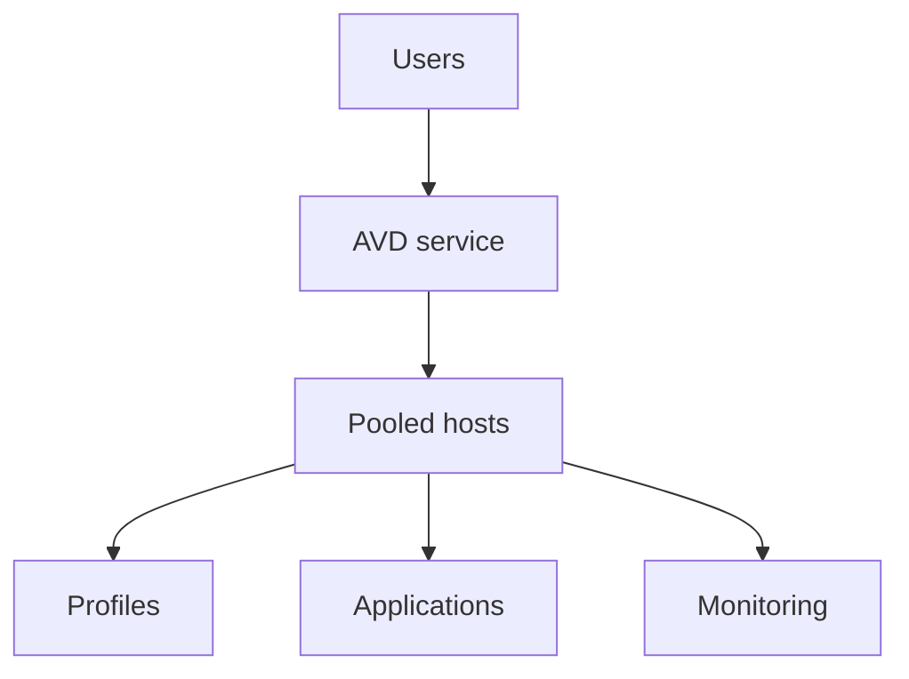
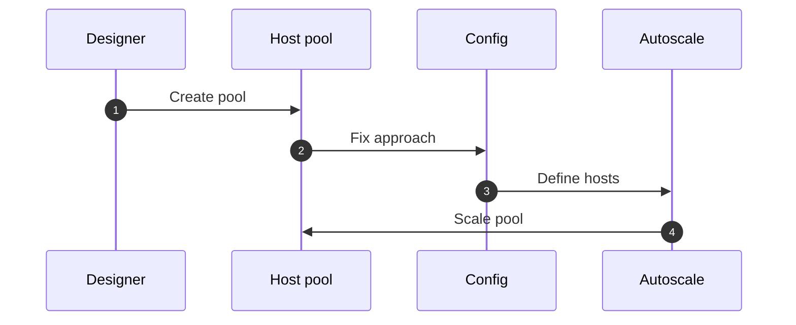

# What good looks like

!!! abstract "At a glance"
    - The North Star is the target state for a modern Azure Virtual Desktop (AVD) platform, using features Microsoft made available through 2026.
    - Session hosts are disposable. They're created from a configuration, replaced rather than repaired, and scaled by creating and deleting them.
    - Identity is cloud-native: session hosts are Microsoft Entra joined and managed by Intune. Hybrid join is a stepping stone for the applications that need it.
    - The image is lean. Applications arrive with App Attach and profiles roam with FSLogix on Azure Files.
    - Everything on this page is generally available. Each row links to the deep dive and to Microsoft Learn.

## In plain terms

Level 100

Think of the North Star as a modern apartment building rather than a row of owned houses. People use an apartment when they need it, their belongings are stored separately, and the building manager can add or refresh apartments from a standard plan.

For Azure Virtual Desktop, that means session hosts are disposable, profiles and applications are separate from the operating system, and the platform creates, updates and deletes hosts from a known configuration.

This simple flow shows the target state.

## The North Star on one page

The table below is the North Star on one page. Each layer has one recommended choice. The deep-dive pages explain the reasoning, the alternatives and the configuration.

| Layer | North Star choice | Status | Deep dive |
| --- | --- | --- | --- |
| Operating system | Windows 11 Enterprise multi-session, from the Azure Marketplace. 26H2 images are available, with and without Microsoft 365 Apps ([What's new, September 2026](https://learn.microsoft.com/azure/virtual-desktop/whats-new#september-2026)) | GA | [Images](../images/index.md) |
| Host pool type | Pooled host pools for shared desktops and RemoteApp | GA | [Host pools](../host-pools/index.md) |
| Host pool management | Session host configuration, also called automated host pools: a single configuration that defines every session host in the pool ([Host pool management approaches](https://learn.microsoft.com/azure/virtual-desktop/host-pool-management-approaches)) | GA | [Host pools](../host-pools/index.md) |
| Image rollout | Session host update replaces hosts in batches when the configuration changes ([Session host update](https://learn.microsoft.com/azure/virtual-desktop/session-host-update)) | GA | [Images](../images/index.md) |
| Scaling | Dynamic autoscaling creates and deletes session hosts to match demand ([Autoscale scenarios](https://learn.microsoft.com/azure/virtual-desktop/autoscale-scenarios)) | GA | [Scaling](../scaling/index.md) |
| OS disk | Ephemeral OS disks: the OS lives on the VM's local storage, with no OS disk to store ([Ephemeral OS disks on AVD](https://learn.microsoft.com/azure/virtual-desktop/deploy/session-hosts/ephemeral-os-disks)) | GA | [Host pools](../host-pools/index.md) |
| Host pool identity | A managed identity on the host pool, used by session host configuration, autoscale and Start VM on Connect ([Configure managed identity](https://learn.microsoft.com/azure/virtual-desktop/configure-managed-identity)) | GA | [Host pools](../host-pools/index.md) |
| Session host identity | Microsoft Entra joined and enrolled in Intune ([Microsoft Entra joined session hosts](https://learn.microsoft.com/azure/virtual-desktop/azure-ad-joined-session-hosts)) | GA | [Identity and access](../identity/index.md) |
| Sign-in | Single sign-on with Microsoft Entra authentication, protected by Conditional Access ([Configure single sign-on](https://learn.microsoft.com/azure/virtual-desktop/configure-single-sign-on)) | GA | [Identity and access](../identity/index.md) |
| Configuration | Intune settings catalog policies, scoped to the multi-session edition ([Intune and multi-session](https://learn.microsoft.com/intune/solutions/azure-virtual-desktop-multi-session)) | GA | [Intune policies](../intune/index.md) |
| Image build | Azure Image Builder, with images versioned and replicated in Azure Compute Gallery ([Azure Image Builder](https://learn.microsoft.com/azure/virtual-machines/image-builder-overview)) | GA | [Images](../images/index.md) |
| Applications | App Attach, with MSIX packages as the destination and App-V packages as a bridge ([App Attach](https://learn.microsoft.com/azure/virtual-desktop/app-attach-overview)) | GA | [App Attach](../app-attach/index.md) |
| Profiles | FSLogix profile containers on Azure Files, using Microsoft Entra Kerberos ([FSLogix on Azure Files with Microsoft Entra ID](https://learn.microsoft.com/fslogix/how-to-configure-profile-container-entra-id-hybrid)) | GA | [User profiles](../profiles/index.md) |
| Connectivity | RDP Shortpath for UDP, RDP Multipath for resilience, private endpoints for storage ([RDP Shortpath](https://learn.microsoft.com/azure/virtual-desktop/rdp-shortpath)) | GA | [Networking](../networking/index.md) |
| Data protection | Screen capture protection, watermarking, clipboard and redirection controls ([Screen capture protection](https://learn.microsoft.com/azure/virtual-desktop/screen-capture-protection)) | GA | [Security](../security/index.md) |
| Observability | Diagnostic settings, Azure Monitor Agent and AVD Insights ([AVD Insights](https://learn.microsoft.com/azure/virtual-desktop/insights)) | GA | [Monitoring](../monitoring/index.md) |
| Delivery | Everything deployed as infrastructure as code, following the AVD landing zone design areas ([Cloud Adoption Framework for AVD](https://learn.microsoft.com/azure/cloud-adoption-framework/scenarios/azure-virtual-desktop/enterprise-scale-landing-zone)) | GA | [How it fits together](how-it-fits-together.md) |

!!! note "Where the status comes from"
    Session host configuration ("automated host pools"), dynamic autoscaling and ephemeral OS disks became available in June 2026, and managed identity support for host pools became generally available in September 2026, according to [What's new in Azure Virtual Desktop](https://learn.microsoft.com/azure/virtual-desktop/whats-new). A few older Learn articles still carry preview wording from before those dates. This site treats What's new as the authority on status.

## The principles behind it

1. **Session hosts are cattle, not pets.** A session host is created from the configuration, serves users and is deleted. Nothing on it is precious, so nothing on it is backed up or repaired. Ephemeral OS disks make this explicit: they [can't be deallocated](https://learn.microsoft.com/azure/virtual-desktop/deploy/session-hosts/ephemeral-os-disks), so scaling creates and deletes hosts instead.
2. **Configuration is the source of truth.** The session host configuration says *what* a host is, the session host management policy says *how* hosts are created and updated, session host update says *when*, and autoscale says *how many* ([Host pool management approaches](https://learn.microsoft.com/azure/virtual-desktop/host-pool-management-approaches)). You change the configuration, not the hosts.
3. **The image is lean.** The base image carries the operating system, updates and the agents every host needs. Applications are delivered with App Attach, so adding or updating an application doesn't mean rebuilding the image.
4. **Identity is cloud-native.** Microsoft Entra join removes the dependency on domain controllers for joining hosts, and Intune replaces Group Policy. A hybrid-joined pool remains available, by exception, for applications that still need it. See [Stepping stones](../getting-there/stepping-stones.md).
5. **Capacity follows demand.** Dynamic autoscaling sizes the pool to the sessions actually in use, within the minimum and maximum you set.
6. **Secure by default.** Data protection controls, least-privilege access and private connectivity are part of the first build, not a later phase.
7. **Everything is code and everything is measured.** The platform is deployed and changed through infrastructure as code, and user experience is measured from day one with AVD Insights and connection data.

## What changes for the people who run it

| Today, in many organisations | In the North Star |
| --- | --- |
| Patch session hosts in place, or rebuild them by hand | Update the session host configuration and let session host update replace hosts in batches |
| One large golden image with every application | A lean base image, with applications attached per user group |
| Domain-joined hosts managed by Group Policy | Entra joined hosts managed by Intune settings catalog policies |
| A fixed number of hosts, powered on and off on a schedule | Hosts created and deleted to match demand |
| Managed OS disks stored for every host, even when it's off | Ephemeral OS disks, with no OS disk storage |
| Profiles tied to a file server and a domain | FSLogix on Azure Files with Microsoft Entra Kerberos |
| Monitoring added after go-live | Diagnostics, Insights and alerts as part of the first build |

## What the North Star isn't

- **It isn't a design for any one organisation.** It's a reference point. Your design decides how far and how fast to move towards it, and records why.
- **It isn't all-or-nothing.** Most organisations run part of their estate on a stepping stone, such as a hybrid-joined pool for legacy applications, while the rest moves to the North Star. See [Getting there](../getting-there/index.md).
- **It isn't static.** As Azure Virtual Desktop changes, the North Star changes with it. Every page links to the Microsoft Learn articles it's based on, and this version reflects Microsoft Learn as at October 2026.

## Under the hood

Level 400

The North Star depends on a host pool created with the session host configuration management approach. Microsoft says the management approach is set at host pool creation and cannot be changed later ([Host pool management approaches](https://learn.microsoft.com/azure/virtual-desktop/host-pool-management-approaches)). That is why the North Star is a new pool, not a conversion of an old one.

## Next

- [How it fits together](how-it-fits-together.md) - the components, the flows and the lifecycle of a session host.
- [Dependency checklist](../getting-there/dependencies.md) - what has to be in place before the North Star works.
