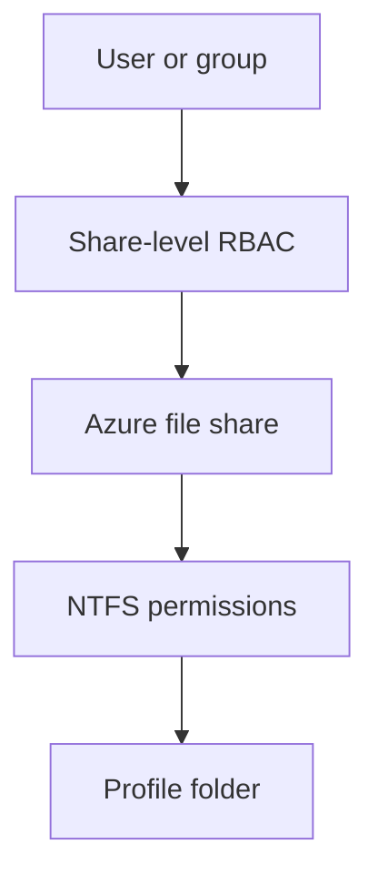

# Access and permissions

Level 300

This page explains how a Microsoft Entra joined session host reaches an Azure Files profile share without joining the host to Active Directory Domain Services.

This diagram shows the two permission layers.

## Identity and permissions

Microsoft Entra Kerberos uses Microsoft Entra ID to issue Kerberos tickets for SMB access. Learn states that Azure Files receives the Kerberos ticket, not the user's access credentials ([Overview of Azure Files identity-based authentication for SMB access](https://learn.microsoft.com/azure/storage/files/storage-files-active-directory-overview)).

Set share-level permissions first, then NTFS permissions. Learn lists these built-in Azure RBAC roles for Azure Files: **Storage File Data SMB Share Reader**, **Storage File Data SMB Share Contributor**, **Storage File Data SMB Share Elevated Contributor**, **Storage File Data Privileged Contributor**, **Storage File Data Privileged Reader**, **Storage File Data SMB Admin**, and **Storage File Data SMB Take Ownership** ([Assign share-level permissions for Azure file shares](https://learn.microsoft.com/azure/storage/files/storage-files-identity-assign-share-level-permissions)).

For FSLogix profile containers, assign users or groups **Storage File Data SMB Share Contributor** at the share level, then set NTFS permissions so users can create and access only their own profile folders. Administrative groups that manage ACLs need **Storage File Data SMB Share Elevated Contributor** or a more privileged role where justified ([Assign share-level permissions for Azure file shares](https://learn.microsoft.com/azure/storage/files/storage-files-identity-assign-share-level-permissions)).

Each session host must be able to retrieve Microsoft Entra Kerberos tickets. Learn requires enabling **Kerberos/CloudKerberosTicketRetrievalEnabled** and setting it to `1`; when using Intune, Learn says to use the **Settings Catalog** instead of the OMA-URI method because OMA-URI does not work on Azure Virtual Desktop multi-session devices ([Enable Microsoft Entra Kerberos authentication for hybrid and cloud-only identities on Azure Files](https://learn.microsoft.com/azure/storage/files/storage-files-identity-auth-hybrid-identities-enable)).

For a deeper explanation of Kerberos tickets, see [Tokens and tickets](../demystified/tokens-and-tickets.md). For the full Azure Virtual Desktop sign-in path, see [AVD sign-in end to end](../demystified/avd-sign-in-end-to-end.md).

## Under the hood

Level 400

Microsoft Learn describes the Azure Files Kerberos flow as follows: the client sends the request to the identity source, the identity source returns a Kerberos ticket, and the client sends a request that includes the Kerberos ticket. Azure Files receives the Kerberos ticket, not the user's access credentials ([Overview of Azure Files identity-based authentication for SMB access](https://learn.microsoft.com/azure/storage/files/storage-files-active-directory-overview)).

For Microsoft Entra Kerberos, Learn also lists required client services. **WinHTTP Web Proxy Auto-Discovery Service** (`WinHttpAutoProxySvc`) and **IP Helper** (`iphlpsvc`) must be running, because the former is responsible for Kerberos Key Distribution Center Proxy requests and the latter is required by the authentication flow ([Enable Microsoft Entra Kerberos authentication for hybrid and cloud-only identities on Azure Files](https://learn.microsoft.com/azure/storage/files/storage-files-identity-auth-hybrid-identities-enable)).

---

Part of [User profiles with FSLogix](index.md).
