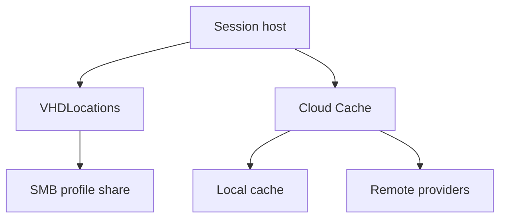

# FSLogix settings and resilience

Level 300

This page turns the profile design into settings. The goal is simple: enable profile containers, point them at the right SMB paths, keep identity roaming off for Microsoft Entra joined hosts, and use Cloud Cache only when its trade-offs are understood.

This diagram shows the difference between the basic container path and Cloud Cache.

## Configuration

Configure FSLogix profile settings under `HKEY_LOCAL_MACHINE\SOFTWARE\FSLogix\Profiles` or through policy. These are the North Star defaults to start from:

| Setting | Recommended value | Source |
| --- | --- | --- |
| **Enabled** | `1` | Required to enable profile containers ([FSLogix configuration setting reference](https://learn.microsoft.com/fslogix/reference-configuration-settings)). |
| **VHDLocations** | UNC path or paths to the Azure Files profile share | Required list of SMB locations for profile VHD or VHDX files ([FSLogix configuration setting reference](https://learn.microsoft.com/fslogix/reference-configuration-settings)). |
| **ProfileType** | `0` | Normal profile behaviour. Learn says if the VHD is not accessed concurrently, **ProfileType** should be `0` ([FSLogix configuration setting reference](https://learn.microsoft.com/fslogix/reference-configuration-settings)). |
| **SizeInMBs** | Start from the Learn default `30000`, then size for the persona | Learn default is `30000` MB and can be increased later, but not decreased for existing containers ([FSLogix configuration setting reference](https://learn.microsoft.com/fslogix/reference-configuration-settings)). |
| **IsDynamic** | `1` | Learn default is dynamic VHD or VHDX growth up to **SizeInMBs** ([FSLogix configuration setting reference](https://learn.microsoft.com/fslogix/reference-configuration-settings)). |
| **VolumeType** | `vhdx` | Learn says `vhdx` creates VHDX files; use VHDX for current deployments ([FSLogix configuration setting reference](https://learn.microsoft.com/fslogix/reference-configuration-settings)). |
| **DeleteLocalProfileWhenVHDShouldApply** | `1` only after migration testing | Learn warns this permanently deletes a matching local profile ([FSLogix configuration setting reference](https://learn.microsoft.com/fslogix/reference-configuration-settings)). |
| **FlipFlopProfileDirectoryName** | `1` for readable `%username%_%sid%` folders, set before production | Learn warns changing it after containers exist causes FSLogix to look for a different folder naming convention ([FSLogix configuration setting reference](https://learn.microsoft.com/fslogix/reference-configuration-settings)). |
| **RoamIdentity** | `0` | Learn recommends the default and says do not enable it if using Intune or Microsoft Entra joined devices ([FSLogix configuration setting reference](https://learn.microsoft.com/fslogix/reference-configuration-settings)). |

!!! warning "Kerberos hardening"
    Microsoft Learn flags an upcoming Windows change where the default Kerberos encryption type changes from RC4 to AES-SHA1. File shares hosting FSLogix containers that are not upgraded to AES-SHA1 might have access issues after the update is applied ([Container storage options](https://learn.microsoft.com/fslogix/concepts-container-storage-options)).

## Cloud Cache

FSLogix Cloud Cache can write profile data to multiple providers using **CCDLocations**. Learn documents **CCDLocations** using `type=smb` for SMB providers and `type=azure` for Azure page blobs, and warns not to use plain-text Azure page blob connection strings ([FSLogix configuration setting reference](https://learn.microsoft.com/fslogix/reference-configuration-settings)).

Use Cloud Cache only when you have a clear resilience or locality requirement that is worth the operational cost. Learn documents settings such as **HealthyProvidersRequiredForRegister** and warns that some combinations can discard local profile data without flushing it to a Cloud Cache provider, causing permanent deletion of session data stored in the local cache ([FSLogix configuration setting reference](https://learn.microsoft.com/fslogix/reference-configuration-settings)).

## Backup and recovery

Use Azure Backup for Azure Files. Learn describes Azure Files backup as a native cloud solution and says it supports **snapshot** and **vaulted** backups for Azure file shares ([About Azure Files backup](https://learn.microsoft.com/azure/backup/azure-file-share-backup-overview)).

Also design operational recovery. Backup protects the share, but profile recovery still needs runbooks for accidental deletion, corrupt containers, locked VHDX files, and user restore requests. Align those runbooks with [business continuity and disaster recovery](../bcdr/index.md).

## Under the hood

Level 400

Cloud Cache uses **CCDLocations**, not **VHDLocations**, and the locations are ordered. Learn says Cloud Cache uses storage providers based on the order of entries in `CCDLocations`, uses a locally mounted container for periodic updates to remote providers, and adds performance and storage requirements to the virtual machine for local cache I/O ([Cloud Cache Overview](https://learn.microsoft.com/fslogix/concepts-fslogix-cloud-cache)).

Cloud Cache also uses queue, index, proxy, lock and meta files. Learn says `*.queue` files track `*.index` files that have not flushed, `*.index` files contain batches of block-level changes, the proxy file represents the registered container, the lock file determines which virtual machine has the I/O lock, and the meta file tracks container state and sequence ([Cloud Cache Overview](https://learn.microsoft.com/fslogix/concepts-fslogix-cloud-cache)).

At sign-out, Cloud Cache can delay the user if one or more providers do not contain all updates. Learn says the delay depends on **HealthyProvidersRequiredForUnregister** and **CcdUnregisterTimeout** ([Cloud Cache Overview](https://learn.microsoft.com/fslogix/concepts-fslogix-cloud-cache), [Configuration Setting Reference](https://learn.microsoft.com/fslogix/reference-configuration-settings)).

---

Part of [User profiles with FSLogix](index.md).
