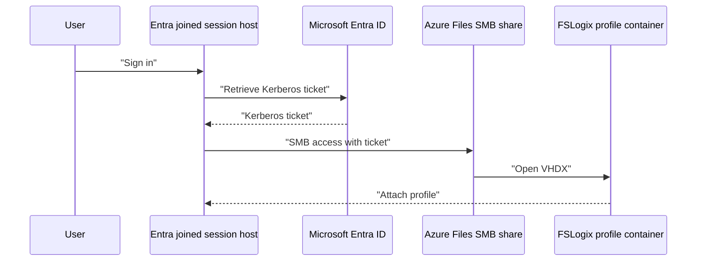

# User profiles with FSLogix

!!! abstract "At a glance"
    - FSLogix profile containers make non-persistent pooled desktops feel persistent by attaching a user's profile at sign-in.
    - The North Star stores FSLogix containers on Azure Files SMB shares using Microsoft Entra Kerberos for identity-based access.
    - Azure Files performance must be sharded by IOPS and throughput, not just by capacity.
    - Session hosts need the **Kerberos/CloudKerberosTicketRetrievalEnabled** policy set to `1`.
    - Cloud Cache is an option for specific resilience needs, but it adds complexity and can affect sign-in and sign-out behaviour.

## What it is

FSLogix profile containers roam a user's Windows profile in a virtual desktop environment. Microsoft Learn says Azure Virtual Desktop offers FSLogix profile containers as the recommended user profile solution, and that at sign-in the container is dynamically attached using VHD or VHDX so the profile appears like a native user profile ([Storage options for FSLogix profile containers in Azure Virtual Desktop](https://learn.microsoft.com/azure/virtual-desktop/store-fslogix-profile)).

In a pooled host pool, session hosts are non-persistent. With ephemeral OS disks and dynamic autoscaling, a user may land on different hosts across the week. Without FSLogix, user settings, application data and shell state either disappear, remain trapped on one host, or require slow roaming profile mechanisms. FSLogix separates the profile from the host so session hosts can be disposable while the user experience remains consistent.

**Status:** Generally available for FSLogix profile containers on Azure Virtual Desktop. Learn states FSLogix profile containers are the recommended user profile solution for Azure Virtual Desktop ([Storage options for FSLogix profile containers in Azure Virtual Desktop](https://learn.microsoft.com/azure/virtual-desktop/store-fslogix-profile)).

## How it fits

The North Star uses Azure Files because Microsoft Learn recommends Azure Files for most Azure Virtual Desktop FSLogix profile container deployments, and because Azure Files is an Azure-native SMB platform service with LRS, ZRS, GRS and GZRS redundancy options ([Storage options for FSLogix profile containers in Azure Virtual Desktop](https://learn.microsoft.com/azure/virtual-desktop/store-fslogix-profile), [Container storage options](https://learn.microsoft.com/fslogix/concepts-container-storage-options)).

Azure NetApp Files remains a documented alternative. Learn lists Azure NetApp Files as a platform service suitable for general purpose to enterprise scale profile storage, with Standard, Premium and Ultra service levels, but regional availability is more limited than Azure Files ([Storage options for FSLogix profile containers in Azure Virtual Desktop](https://learn.microsoft.com/azure/virtual-desktop/store-fslogix-profile)).

## North Star recommendation

Use Azure Files SMB shares with Microsoft Entra Kerberos authentication. Keep storage accounts close to the session hosts, use private endpoints, and shard users across storage accounts and shares so sign-in storms do not exceed documented Azure Files limits. Deliver FSLogix settings through Intune; see [Intune management](../intune/index.md) for the management pattern.

**Status:** Microsoft Entra Kerberos for Azure Files is a supported identity source for SMB access. Learn lists **Microsoft Entra Kerberos** as one of the three Azure Files identity sources and says it supports Microsoft Entra joined clients and FSLogix profiles ([Overview of Azure Files identity-based authentication for SMB access](https://learn.microsoft.com/azure/storage/files/storage-files-active-directory-overview)).

!!! note "Cloud-only and external identities"
    FSLogix support for cloud-only and external identities is generally available as of May 2026. Microsoft Learn also documents Microsoft Entra Kerberos for hybrid and cloud-only identities, including Windows 11 Enterprise/Pro single or multi-session prerequisites for cloud-only identities ([What's new in Azure Virtual Desktop](https://learn.microsoft.com/azure/virtual-desktop/whats-new), [Enable Microsoft Entra Kerberos authentication for hybrid and cloud-only identities on Azure Files](https://learn.microsoft.com/azure/storage/files/storage-files-identity-auth-hybrid-identities-enable)).

## Design decisions

| Decision | North Star choice | Why |
| --- | --- | --- |
| Profile technology | FSLogix profile containers | Recommended profile solution for Azure Virtual Desktop ([Store FSLogix profile containers](https://learn.microsoft.com/azure/virtual-desktop/store-fslogix-profile)). |
| Storage | Azure Files SMB | Recommended by Learn for most customers and supports SMB profile containers ([Store FSLogix profile containers](https://learn.microsoft.com/azure/virtual-desktop/store-fslogix-profile)). |
| Identity | Microsoft Entra Kerberos | Supports Microsoft Entra joined clients and FSLogix profiles without domain controller connectivity for authentication ([Azure Files identity overview](https://learn.microsoft.com/azure/storage/files/storage-files-active-directory-overview)). |
| Network exposure | Private endpoints | Azure Files private endpoints provide private IP access inside a virtual network ([Configure network endpoints for Azure file shares](https://learn.microsoft.com/azure/storage/files/storage-files-networking-endpoints)). |
| Sharding | Multiple shares and storage accounts by IOPS | Azure Files scale targets apply at both storage account and share levels ([Azure Files scale targets](https://learn.microsoft.com/azure/storage/files/storage-files-scale-targets)). |

## In this section

-   __[Access and permissions](access-and-permissions.md)__

    ---

    Microsoft Entra Kerberos for Azure Files, share-level and NTFS permissions, and the Kerberos setting session hosts need.

-   __[Sizing and sharding](sizing-and-sharding.md)__

    ---

    Sizing profile storage by IOPS, Azure Files limits, and a worked sharding example.

-   __[FSLogix settings and resilience](fslogix-settings.md)__

    ---

    The key FSLogix settings, Cloud Cache and backup.

## Common pitfalls

- Sizing by average profile capacity only. FSLogix bottlenecks are often sign-in IOPS and metadata operations.
- Putting all users in one storage account. Azure Files account limits matter as much as share limits.
- Enabling **RoamIdentity** on Microsoft Entra joined or Intune managed hosts. Learn says not to do that.
- Changing folder naming settings after production containers exist.
- Forgetting **Kerberos/CloudKerberosTicketRetrievalEnabled** on multi-session hosts.
- Mixing App Attach images and FSLogix containers on the same share.

## Microsoft Learn

- [Storage options for FSLogix profile containers in Azure Virtual Desktop](https://learn.microsoft.com/azure/virtual-desktop/store-fslogix-profile)
- [Container storage options](https://learn.microsoft.com/fslogix/concepts-container-storage-options)
- [Configuration Setting Reference](https://learn.microsoft.com/fslogix/reference-configuration-settings)
- [Overview of Azure Files identity-based authentication for SMB access](https://learn.microsoft.com/azure/storage/files/storage-files-active-directory-overview)
- [Enable Microsoft Entra Kerberos authentication for hybrid and cloud-only identities on Azure Files](https://learn.microsoft.com/azure/storage/files/storage-files-identity-auth-hybrid-identities-enable)
- [Assign share-level permissions for Azure file shares](https://learn.microsoft.com/azure/storage/files/storage-files-identity-assign-share-level-permissions)
- [Scalability and performance targets for Azure Files](https://learn.microsoft.com/azure/storage/files/storage-files-scale-targets)
- [Configure network endpoints for accessing Azure file shares](https://learn.microsoft.com/azure/storage/files/storage-files-networking-endpoints)
- [About Azure Files backup](https://learn.microsoft.com/azure/backup/azure-file-share-backup-overview)
