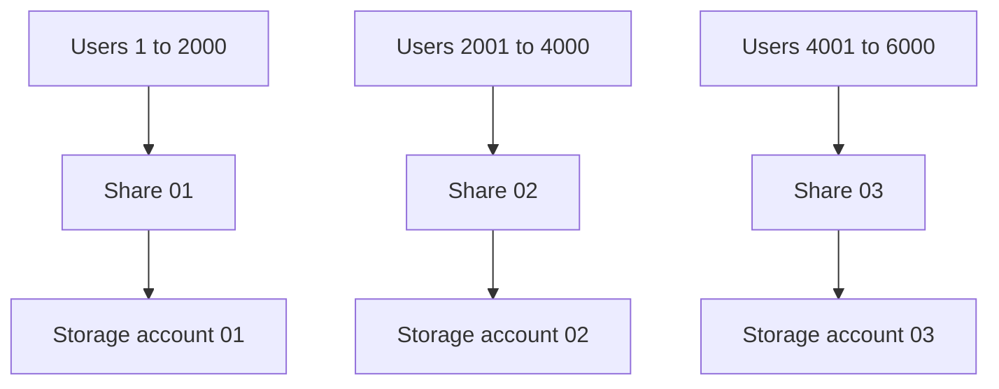

# Sizing and sharding

Level 300

This page explains why profile storage is split across shares and storage accounts. The detailed number catalogue lives in [Sizing estimates](../overview/sizing-estimates.md); this page focuses on the profile design pattern.

This diagram shows sharding by user group.

Learn gives example FSLogix profile requirements of **10 IOPS** per user at steady state and **50 IOPS** per user at sign-in or sign-out ([Container storage options](https://learn.microsoft.com/fslogix/concepts-container-storage-options)). Learn also states that Azure Files SSD provisioned v2 storage accounts and file shares can reach **102,400 IOPS**, and that storage account resources share the limits that apply to the storage account ([Scalability and performance targets for Azure Files](https://learn.microsoft.com/azure/storage/files/storage-files-scale-targets)).

For Contoso with 10,000 pooled users, steady state is about 100,000 IOPS if every user is active, which fits just under one 102,400 IOPS limit in theory. Sign-in or sign-out is different: 10,000 users at 50 IOPS is 500,000 IOPS. That cannot fit into one share or one SSD provisioned v2 storage account.

A practical starting design is five shards, each with 2,000 users:

| Shard | Users | Sign-in IOPS at 50 per user | Steady state IOPS at 10 per user | Storage account |
| --- | ---: | ---: | ---: | --- |
| Profile shard 01 | 2,000 | 100,000 | 20,000 | `stprof01` |
| Profile shard 02 | 2,000 | 100,000 | 20,000 | `stprof02` |
| Profile shard 03 | 2,000 | 100,000 | 20,000 | `stprof03` |
| Profile shard 04 | 2,000 | 100,000 | 20,000 | `stprof04` |
| Profile shard 05 | 2,000 | 100,000 | 20,000 | `stprof05` |

This design uses separate storage accounts, not just separate shares, because the storage account is also a shared pool of IOPS and throughput in the classic Azure Files model ([Scalability and performance targets for Azure Files](https://learn.microsoft.com/azure/storage/files/storage-files-scale-targets)). It is still only a starting point. Measure real sign-in concurrency, profile size, metadata operations and application behaviour before locking the shard size.

## Under the hood

Level 400

The sharding trigger is not only capacity. Learn says storage accounts are a shared pool of storage, IOPS and throughput, and resources in the storage account share the limits that apply to that account ([Scalability and performance targets for Azure Files](https://learn.microsoft.com/azure/storage/files/storage-files-scale-targets)). A design with five shares in one storage account can still hit the account-level IOPS or throughput limit.

For profile sign-in waves, model at least three values:

1. Active users per shard.
2. Concurrent sign-ins and sign-outs per shard.
3. Metadata and open handle behaviour for the chosen workload.

Keep the detailed numeric catalogue in [Sizing estimates](../overview/sizing-estimates.md), so this page does not become a second source of truth.

---

Part of [User profiles with FSLogix](index.md).
