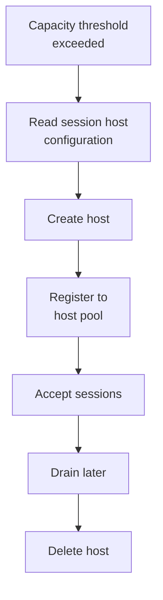

# Dynamic autoscaling

Level 300

Dynamic Autoscaling changes the number of hosts in the pool. It uses the session host configuration as the template when it needs to create a new host.

## Dynamic Autoscaling design guidance

Dynamic Autoscaling uses the session host configuration as the source for hosts it creates. The Autoscale FAQ states that Autoscale creates session hosts with the latest valid or stable image version defined in the default session host configuration if there is no active session host configuration in [Autoscale FAQ](https://learn.microsoft.com/azure/virtual-desktop/autoscale-faq#which-image-version-is-used-for-the-session-hosts-created-by-autoscale).

The important settings are:

- **Minimum host pool size**: the floor for host count. Microsoft says it overrides the number of session hosts defined in the host pool in [Autoscale FAQ](https://learn.microsoft.com/azure/virtual-desktop/autoscale-faq#will-the-minimum-host-pool-size-defined-in-the-scaling-plan-override-the-settings-in-the-host-pool).
- **Maximum host pool size**: the ceiling for total host count.
- **Minimum percentage of active hosts (%)**: the active capacity floor during a phase.
- **Capacity threshold**: the used capacity level that triggers scale action.

For ephemeral OS disk pools, set **Minimum percentage of active hosts (%)** to 100 percent in each phase so scaling uses create and delete rather than start and deallocate, per [Ephemeral OS disks on Azure Virtual Desktop](https://learn.microsoft.com/azure/virtual-desktop/deploy/session-hosts/ephemeral-os-disks#dynamic-autoscaling-recommendations).

Segment before tuning:

- Create separate host pools for materially different working days, time zones, and shift patterns. A scaling plan can operate only in its configured time zone, per [Autoscale scenarios](https://learn.microsoft.com/azure/virtual-desktop/autoscale-scenarios#how-a-scaling-plan-works).
- Create separate host pools for materially different application resource patterns. A graphics, browser, or line-of-business workload can have a different density ceiling from a general productivity workload.
- Create separate host pools for identity exceptions. The North Star is Entra-only, but a small hybrid-joined stepping-stone host pool belongs outside the main pool if an application needs AD DS machine identity.
- Model sign-in storms. Microsoft sizing guidance says high concurrent logon rates can significantly affect performance and can cause extended logon times in [Session host virtual machine sizing guidelines](https://learn.microsoft.com/windows-server/remote/remote-desktop-services/session-host-virtual-machine-sizing-guidelines#capacity-planning).

## Capacity buffers

The capacity threshold is a trigger, not a user experience target. A pool can have spare sessions on paper while CPU, memory, profile storage, or sign-in processing is already saturated. Use the documented pilot or simulation approaches in [Session Host Virtual Machine Sizing Guidelines](https://learn.microsoft.com/windows-server/remote/remote-desktop-services/session-host-virtual-machine-sizing-guidelines#capacity-planning), then select a **Max session limit** and threshold that leave headroom for logon storms.

The full sizing tables belong in [Sizing estimates](../overview/sizing-estimates.md). Use this page to decide how those estimates become scaling plan settings.

This diagram shows the dynamic path for an ephemeral OS disk pool.

## Under the hood

Level 400

Microsoft says the **Minimum host pool size** in the scaling plan overrides the session host count defined on the host pool, and that Autoscale creates hosts with the latest valid or stable image version defined in the default session host configuration ([Autoscale FAQ](https://learn.microsoft.com/azure/virtual-desktop/autoscale-faq)).

For ephemeral OS disk pools, set **Minimum percentage of active hosts (%)** to 100 percent in each phase. Microsoft recommends this because ephemeral hosts do not support starting and deallocating, so scaling should create and delete hosts instead ([Ephemeral OS disks on Azure Virtual Desktop](https://learn.microsoft.com/azure/virtual-desktop/deploy/session-hosts/ephemeral-os-disks#dynamic-autoscaling-recommendations)).

---

Part of [Scaling](index.md).
