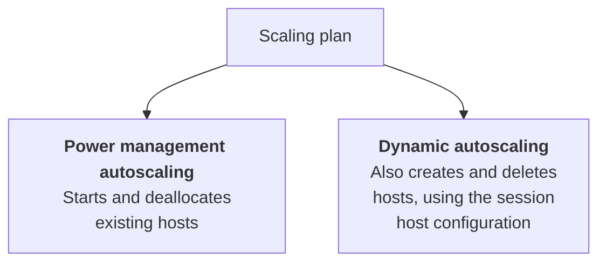

# Scaling

!!! abstract "At a glance"
    - Use Autoscale scaling plans for pooled host pools. Do not run another scaling engine against the same host pool.
    - Use power management Autoscale for standard management pools and dynamic Autoscale for pooled host pools with session host configuration.
    - For ephemeral OS disk session hosts, design around create and delete. They cannot be stop-deallocated.
    - Segment host pools by usage pattern, time zone, application set, and capacity behaviour before tuning thresholds.
    - Enable Autoscale diagnostics and use Azure Virtual Desktop Insights to review decisions, not just VM power state.

## What it is

Autoscale is the Azure Virtual Desktop service feature that adjusts session host capacity in a host pool according to schedules and demand. A scaling plan defines the schedules and settings for the host pools it is assigned to. Microsoft Learn states that you can assign one scaling plan to multiple host pools, but each host pool can have only one scaling plan assigned in [Autoscale scaling plans and example scenarios](https://learn.microsoft.com/azure/virtual-desktop/autoscale-scenarios#how-a-scaling-plan-works).

There are two scaling methods:

- **Power management autoscaling** powers session hosts on and off to adjust available capacity. Microsoft says this is the option to use for a host pool with standard management in [Autoscale scaling plans and example scenarios](https://learn.microsoft.com/azure/virtual-desktop/autoscale-scenarios#how-a-scaling-plan-works).
- **Dynamic autoscaling** powers hosts on and off and also creates and deletes hosts. Microsoft says it can be used only for pooled host pools with session host configuration in [Autoscale scaling plans and example scenarios](https://learn.microsoft.com/azure/virtual-desktop/autoscale-scenarios#how-a-scaling-plan-works).

**Status: Generally available.** The [What's new in Azure Virtual Desktop](https://learn.microsoft.com/azure/virtual-desktop/whats-new#june-2026) page says Dynamic autoscaling is now available for pooled host pools with session host configuration. This site uses What's new as the status source where older feature or troubleshooting articles still contain preview-era wording.

!!! note "Status source"
    If another Learn article still calls Dynamic Autoscaling preview, treat that as stale lifecycle wording and use the June 2026 What's new entry as the status source.

## How it fits

Power management is about the power state of existing VMs. Dynamic Autoscaling is about the size of the host pool as well as power state. That distinction matters because ephemeral OS disk hosts cannot be stop-deallocated, and Microsoft recommends Dynamic Autoscaling for host pools that include session hosts with ephemeral OS disks in [Ephemeral OS disks on Azure Virtual Desktop](https://learn.microsoft.com/azure/virtual-desktop/deploy/session-hosts/ephemeral-os-disks#dynamic-autoscaling-recommendations).

## North Star recommendation

Use **Dynamic Autoscaling** for pooled host pools built with session host configuration. Let Azure Virtual Desktop be the only authority that creates, deletes, starts, drains, and stops hosts in that pool. Do not combine Autoscale with Azure Automation scaling scripts or any other scaling tool, as documented in [Autoscale scaling plans and example scenarios](https://learn.microsoft.com/azure/virtual-desktop/autoscale-scenarios).

Configure a managed identity on the host pool. Managed identity support is generally available for session host configuration, Autoscale, and Start VM on Connect, and Microsoft says SHC host pools will require it to add session hosts in a future service update in [What's new](https://learn.microsoft.com/azure/virtual-desktop/whats-new#september-2026). The configuration steps are documented in [Configure managed identity in Azure Virtual Desktop](https://learn.microsoft.com/azure/virtual-desktop/configure-managed-identity).

For pools with ephemeral OS disks, use a configuration that creates and deletes hosts rather than one that depends on deallocation. The Azure Virtual Desktop ephemeral OS disk page says VMs using ephemeral OS disks cannot be deallocated and recommends setting **Minimum percentage of active hosts (%)** to 100 percent for each scaling plan phase so the process creates and deletes hosts rather than starting and deallocating them in [Dynamic Autoscaling Recommendations](https://learn.microsoft.com/azure/virtual-desktop/deploy/session-hosts/ephemeral-os-disks#dynamic-autoscaling-recommendations).

## Design decisions

| Decision | North Star choice | Why |
|---|---|---|
| Scaling authority | Azure Virtual Desktop Autoscale only | Microsoft says not to combine Autoscale with other scaling tools on the same host pool in [Autoscale scenarios](https://learn.microsoft.com/azure/virtual-desktop/autoscale-scenarios). |
| Scaling method | Dynamic Autoscaling for session host configuration pools | It can create and delete hosts as well as start and stop them, and Microsoft says it is only for pooled host pools with session host configuration in [Autoscale scenarios](https://learn.microsoft.com/azure/virtual-desktop/autoscale-scenarios#how-a-scaling-plan-works). |
| Ephemeral hosts | Create and delete, not deallocate | Ephemeral OS disk VMs cannot be deallocated, and Microsoft recommends **Minimum percentage of active hosts (%)** at 100 percent in every phase so Dynamic Autoscaling creates and deletes hosts, per [Ephemeral OS disks on Azure Virtual Desktop](https://learn.microsoft.com/azure/virtual-desktop/deploy/session-hosts/ephemeral-os-disks#dynamic-autoscaling-recommendations). |
| Host pool segmentation | Separate by usage pattern and time zone | Scaling plans operate in one configured time zone and Microsoft says you need to understand usage patterns before defining schedules in [Autoscale scenarios](https://learn.microsoft.com/azure/virtual-desktop/autoscale-scenarios#how-a-scaling-plan-works). |
| Load balancing | Breadth-first during ramp-up, depth-first during off-peak | Microsoft recommends breadth-first in ramp-up and depth-first in off-peak in the [create scaling plan article](https://learn.microsoft.com/azure/virtual-desktop/autoscale-create-assign-scaling-plan?tabs=portal%2Cintune&pivots=power-management). |
| Operations evidence | Autoscale diagnostics and Insights | Microsoft recommends using Autoscale diagnostic data integrated with Insights for pooled host pools in [Autoscale diagnostics](https://learn.microsoft.com/azure/virtual-desktop/autoscale-diagnostics). |

## In this section

-   __[Scaling plans](scaling-plans.md)__

    ---

    Scaling plan phases, the roles autoscale needs, Start VM on Connect, drain, force logoff and exclusion tags.

-   __[Dynamic autoscaling](dynamic-autoscaling.md)__

    ---

    Designing dynamic autoscaling, including ephemeral OS disks, sign-in storms and capacity buffers.

-   __[Monitoring and checklist](monitoring-and-checklist.md)__

    ---

    How to watch autoscale at work, and a checklist for configuring it.

## Common pitfalls

- Assigning Autoscale roles below subscription scope.
- Combining Autoscale with another scaling automation on the same pool.
- Using one scaling plan across different time zones or usage patterns.
- Using depth-first without a tested **Max session limit**.
- Ignoring disconnected sessions during ramp-down.
- Forgetting that Autoscale overwrites drain mode for pooled host pools.
- Treating host creation as instant.

## Microsoft Learn

- [Autoscale scaling plans and example scenarios in Azure Virtual Desktop](https://learn.microsoft.com/azure/virtual-desktop/autoscale-scenarios)
- [Create and assign an autoscale scaling plan for Azure Virtual Desktop](https://learn.microsoft.com/azure/virtual-desktop/autoscale-create-assign-scaling-plan)
- [Azure Virtual Desktop autoscale FAQ](https://learn.microsoft.com/azure/virtual-desktop/autoscale-faq)
- [Set up diagnostics for Autoscale in Azure Virtual Desktop](https://learn.microsoft.com/azure/virtual-desktop/autoscale-diagnostics)
- [Configure Start VM on Connect for Azure Virtual Desktop](https://learn.microsoft.com/azure/virtual-desktop/start-virtual-machine-connect)
- [Ephemeral OS disks on Azure Virtual Desktop](https://learn.microsoft.com/azure/virtual-desktop/deploy/session-hosts/ephemeral-os-disks)
- [Configure managed identity in Azure Virtual Desktop](https://learn.microsoft.com/azure/virtual-desktop/configure-managed-identity)
- [Configure host pool load balancing in Azure Virtual Desktop](https://learn.microsoft.com/azure/virtual-desktop/configure-host-pool-load-balancing)
- [Session Host Virtual Machine Sizing Guidelines for Remote Desktop](https://learn.microsoft.com/windows-server/remote/remote-desktop-services/session-host-virtual-machine-sizing-guidelines)
