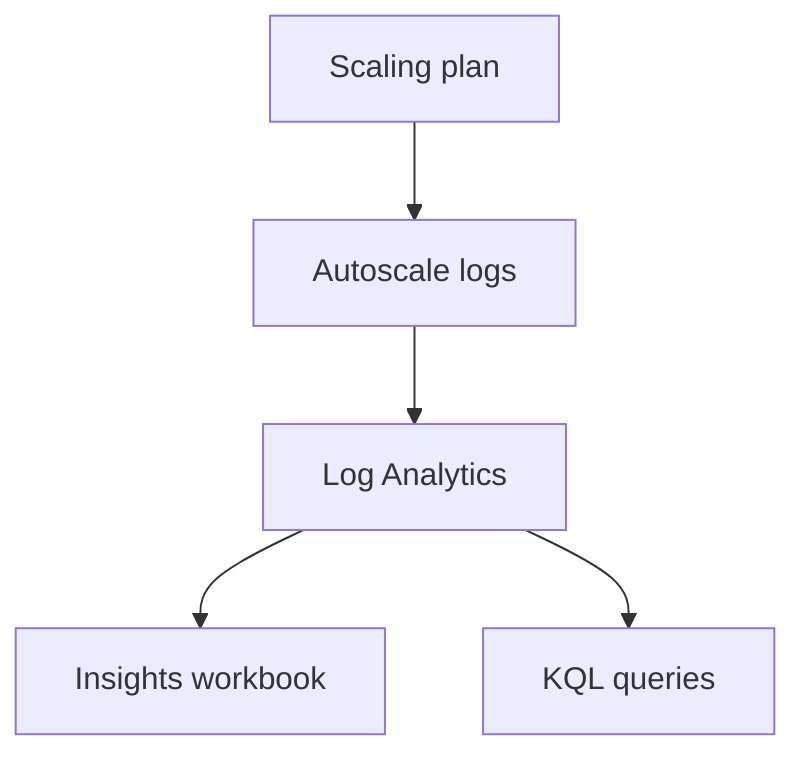

# Monitoring and checklist

<span class="level l300">Level 300</span>

Monitoring tells you what Autoscale decided, not just whether a virtual machine is on. Use it to prove whether the scaling plan, permissions, host health, or capacity assumptions need adjustment.

## Monitoring Autoscale

Enable diagnostic logs for scaling plans. The diagnostic category is **Autoscale logs**, and Microsoft Learn says diagnostic logs for Autoscale can be sent to an Azure Storage account or Microsoft Azure Event Hubs. For pooled host pools, Microsoft recommends Autoscale diagnostic data integrated with Azure Virtual Desktop Insights for a more comprehensive view in [Set up diagnostics for Autoscale](https://learn.microsoft.com/azure/virtual-desktop/autoscale-diagnostics).

Autoscale diagnostic records include fields such as **CorrelationID**, **OperationName**, **ResultType**, and **Message**, as described in [Autoscale diagnostics](https://learn.microsoft.com/azure/virtual-desktop/autoscale-diagnostics#view-diagnostic-logs). Use these to distinguish "the host did not start" from "the plan made the expected decision but another prerequisite failed".

This diagram shows the monitoring path.



## Configuration checklist

1. Create or confirm a pooled host pool with session host configuration.
2. Set the host pool **Load balancing algorithm** and **Max session limit** using evidence from testing.
3. Assign required roles at subscription scope:
    - **Desktop Virtualization Power On Off Contributor** for power management.
    - **Desktop Virtualization Power On Off Contributor** plus **Desktop Virtualization Virtual Machine Contributor** for Dynamic Autoscaling.
4. Create one scaling plan per host pool or one shared scaling plan only where host pools are the same type and genuinely share the same schedule.
5. Define schedules for ramp-up, peak, ramp-down, and off-peak.
6. Set **Exclusion tag** to a non-sensitive maintenance tag such as **excludeFromScaling**.
7. For ephemeral OS disk host pools, configure Dynamic Autoscaling to create and delete hosts, not stop-deallocate them.
8. Enable **Autoscale logs** diagnostic settings and review results in Azure Virtual Desktop Insights.

## Under the hood

<span class="level l400">Level 400</span>

Microsoft documents the `WVDAutoscaleEvaluationPooled` table for pooled host pool Autoscale evaluations. It includes `SessionOccupancyPercent`, `SessionCount`, `ActiveSessionHostCount`, `ConfigSchedulePhase`, `ConfigCapacityThresholdPercent`, `ScalingReasonMessage`, and `ResultType` ([Monitor Autoscale operations with Insights](https://learn.microsoft.com/azure/virtual-desktop/autoscale-monitor-operations-insights#wvdautoscaleevaluationpooled-schema)).

Use this KQL from Microsoft Learn to see operations by day and phase:

```kusto
WVDAutoscaleEvaluationPooled
| where ResultType == "Succeeded"
| extend properties = parse_json(Properties)
| extend BeganStartVmCount = toint(properties.BeganStartVmCount)
| extend BeganDeallocateVmCount = toint(properties.BeganDeallocateVmCount)
| extend BeganForceLogoffOnSessionHostCount = toint(properties.BeganForceLogoffOnSessionHostCount)
| summarize sum(BeganStartVmCount), sum(BeganDeallocateVmCount), sum(BeganForceLogoffOnSessionHostCount) by _ResourceId, bin(TimeGenerated, 1d), ConfigScheduleName, ConfigSchedulePhase
| order by _ResourceId asc, TimeGenerated asc, ConfigScheduleName, ConfigSchedulePhase asc
```

---

Part of [Scaling](index.md).
