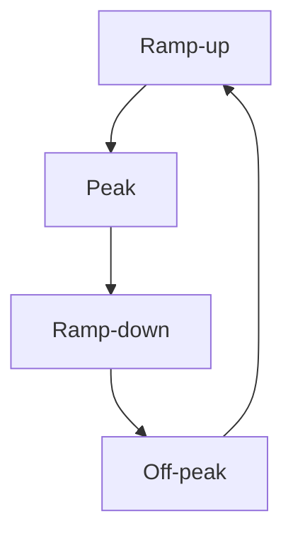

# Scaling plans

Level 300

A scaling plan is the timetable and rulebook for Autoscale. It tells Azure Virtual Desktop what phase of the day it is in, how much capacity must stay active, and when to add or remove hosts.

## Scaling plan phases

A scaling plan schedule for pooled host pools has four phases, documented in [Autoscale scaling plans and example scenarios](https://learn.microsoft.com/azure/virtual-desktop/autoscale-scenarios#how-a-scaling-plan-works):

- **Ramp-up**: the start of the day, when usage picks up.
- **Peak hours**: the period when usage is expected to be highest.
- **Ramp-down**: when usage tapers off and hosts are reduced.
- **Off-peak hours**: the lowest-use period.

For pooled host pools, key settings include **Start time**, **Load balancing algorithm**, **Minimum percentage of hosts** or **Minimum percentage of active hosts (%)**, and **Capacity threshold**. Microsoft defines **Capacity threshold** in [Create and assign an autoscale scaling plan](https://learn.microsoft.com/azure/virtual-desktop/autoscale-create-assign-scaling-plan?tabs=portal%2Cintune&pivots=power-management).

The **Peak hours** phase inherits the capacity threshold from **Ramp-up**. The **Off-peak hours** phase inherits the capacity threshold from **Ramp-down**, and Microsoft recommends **depth-first** for off-peak so the pool can gradually reduce the number of running hosts in [Create and assign an autoscale scaling plan](https://learn.microsoft.com/azure/virtual-desktop/autoscale-create-assign-scaling-plan?tabs=portal%2Cintune&pivots=power-management).

This diagram shows the daily phase model.

## Permissions and roles

Autoscale needs Azure permissions because the Azure Virtual Desktop service must act on session host VMs.

For power management Autoscale, assign **Desktop Virtualization Power On Off Contributor** to a managed identity assigned to the host pool or to the Azure Virtual Desktop service principal, with the Azure subscription as the assignable scope. Microsoft warns that assigning the role at a lower scope prevents Autoscale from working properly in [Create and assign an autoscale scaling plan](https://learn.microsoft.com/azure/virtual-desktop/autoscale-create-assign-scaling-plan?tabs=portal%2Cintune&pivots=power-management#assign-permissions-to-the-azure-virtual-desktop-service-principal).

For Dynamic Autoscaling, assign both **Desktop Virtualization Power On Off Contributor** and **Desktop Virtualization Virtual Machine Contributor** to the Azure Virtual Desktop service principal at subscription scope. Microsoft states these roles allow Azure Virtual Desktop to create, delete, update, start, and stop session hosts in [Create and assign an autoscale scaling plan](https://learn.microsoft.com/azure/virtual-desktop/autoscale-create-assign-scaling-plan?tabs=portal%2Cintune&pivots=dynamic#assign-permissions-to-the-azure-virtual-desktop-service-principal).

## Start VM on Connect

**Status: Generally available for the documented scenarios.** Start VM on Connect is documented as a configuration feature in [Configure Start VM on Connect](https://learn.microsoft.com/azure/virtual-desktop/start-virtual-machine-connect).

Start VM on Connect lets an end user start a session host when connecting. For pooled host pools, Microsoft says it starts a session host only when none are powered on, and turns on more VMs only when the first reaches the session limit in [Configure Start VM on Connect](https://learn.microsoft.com/azure/virtual-desktop/start-virtual-machine-connect).

Use it as a user-triggered backstop, not as the primary mechanism for pooled North Star pools. For predictable demand, scale before users arrive. For unexpected demand, Autoscale should add capacity according to the plan.

## Drain, force logoff, and exclusion tags

Autoscale respects capacity threshold and minimum host settings when consolidating. During ramp-down, if you enable force sign-out, Microsoft says Autoscale chooses the session host with the lowest number of active and disconnected sessions, puts it in drain mode, notifies users, signs users out after the wait time, and then deallocates the VM in [Create and assign an autoscale scaling plan](https://learn.microsoft.com/azure/virtual-desktop/autoscale-create-assign-scaling-plan?tabs=portal%2Cintune&pivots=power-management).

If you do not force sign-out, you must choose whether ramp-down can act when **VMs have no active or disconnected sessions** or when **VMs have no active sessions**, per the same [scaling plan article](https://learn.microsoft.com/azure/virtual-desktop/autoscale-create-assign-scaling-plan?tabs=portal%2Cintune&pivots=power-management).

Use an exclusion tag for maintenance. The portal field is **Exclusion tag**, and Microsoft gives **excludeFromScaling** as an example. Microsoft also warns that tagged session hosts are still considered in the minimum percentage calculation, and that sensitive information such as user principal names should not be included in exclusion tag values, in [Create and assign an autoscale scaling plan](https://learn.microsoft.com/azure/virtual-desktop/autoscale-create-assign-scaling-plan?tabs=portal%2Cintune&pivots=power-management).

## Under the hood

Level 400

For Dynamic Autoscaling, assign **Desktop Virtualization Power On Off Contributor** and **Desktop Virtualization Virtual Machine Contributor** to the Azure Virtual Desktop service principal at subscription scope. Microsoft says assigning at a lower scope prevents Autoscale from working properly ([Create and assign an autoscale scaling plan](https://learn.microsoft.com/azure/virtual-desktop/autoscale-create-assign-scaling-plan?tabs=portal%2Cintune&pivots=dynamic#assign-permissions-to-the-azure-virtual-desktop-service-principal)).

Tagged hosts are still counted in minimum percentage calculations. The exclusion tag stops start, stop, and drain-mode changes on that host, but it does not remove the host from capacity maths ([Create and assign an autoscale scaling plan](https://learn.microsoft.com/azure/virtual-desktop/autoscale-create-assign-scaling-plan?tabs=portal%2Cintune&pivots=power-management)).

---

Part of [Scaling](index.md).
