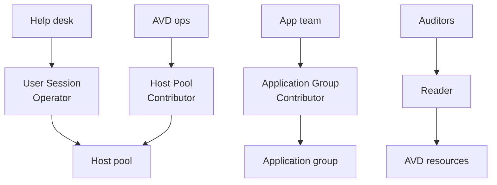

# Least-privilege administration

Level 300

Least privilege means giving each support team only the Azure Virtual Desktop actions it needs, at the narrowest useful scope.

Do not give every operator **Contributor** on the resource group. Azure Virtual Desktop has built-in RBAC roles for common duties [Built-in Azure RBAC roles](https://learn.microsoft.com/azure/virtual-desktop/rbac):

| Role | Use |
| --- | --- |
| **Desktop Virtualization Reader** | Read-only visibility across AVD objects. |
| **Desktop Virtualization Host Pool Contributor** | Manage host pools without broad subscription rights. |
| **Desktop Virtualization Application Group Contributor** | Manage application groups. Learn says assigning users also requires **User Access Administrator**. |
| **Desktop Virtualization User Session Operator** | Send messages, disconnect sessions and log users off without host pool management. |
| **Desktop Virtualization User** | Allow end users to use applications from an application group. |

Scope operational roles to the smallest practical resource group, host pool or application group. Pair Azure RBAC with Privileged Identity Management where available.

This diagram shows the split between reader, operator and contributor access.

---

Part of [Security](index.md).
