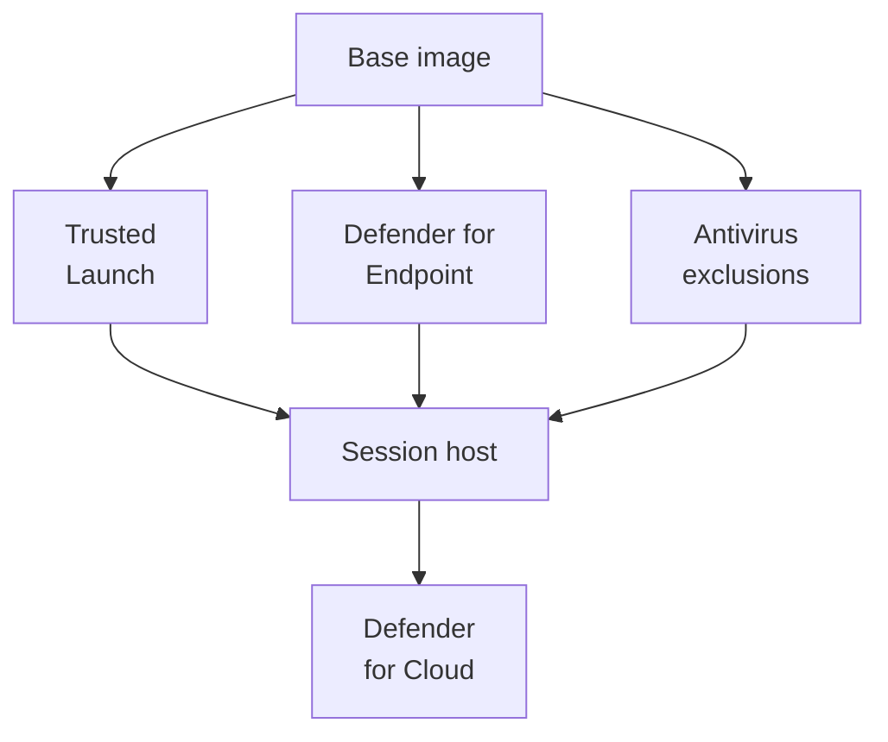

# Session host hardening

Level 300

Host hardening is the baseline protection inside every session host. It starts in the image and is enforced again by Intune and security operations after the host is created.

This diagram shows where the hardening controls apply.

## Trusted Launch

**Status:** Generally available. Learn states Trusted Launch virtual machines are generally available in Azure Virtual Desktop [What's new](https://learn.microsoft.com/azure/virtual-desktop/whats-new#july-2023).

Trusted Launch protects Generation 2 VMs against bootkits, rootkits and low-level malware by enabling coordinated platform technologies, including Secure Boot and vTPM [Trusted Launch for Azure VMs](https://learn.microsoft.com/azure/virtual-machines/trusted-launch). Use Trusted Launch in the image and host pool deployment pipeline unless a specific agent or driver has a documented incompatibility.

## Microsoft Defender for Endpoint

For ephemeral, non-persistent hosts, use the Defender for Endpoint VDI onboarding package in the base image. Learn says the VDI onboarding package onboards non-persistent Windows virtual desktops as the desktops are provisioned [Onboard non-persistent VDI](https://learn.microsoft.com/defender-endpoint/configure-endpoints-vdi).

## Microsoft Defender Antivirus and FSLogix

FSLogix profile containers are mounted virtual disks. Antivirus scanning can affect sign-in performance and profile stability if container paths and FSLogix components are scanned incorrectly. Microsoft Learn documents antivirus file and folder exclusions for FSLogix in the prerequisites article [FSLogix prerequisites](https://learn.microsoft.com/fslogix/overview-prerequisites#configure-antivirus-file-and-folder-exclusions). Apply the exclusions through Intune security policy or Microsoft Defender Antivirus policy and keep them aligned with [User profiles with FSLogix](../profiles/index.md).

## Microsoft Defender for Cloud

Use Microsoft Defender for Cloud for posture management and workload protection recommendations across the Azure subscription that hosts Azure Virtual Desktop. Microsoft Learn's Azure Virtual Desktop security recommendations explicitly points architects to secure the surrounding Azure infrastructure and management plane [Security recommendations for Azure Virtual Desktop](https://learn.microsoft.com/azure/virtual-desktop/security-guide#azure-security-best-practices).

## Under the hood

Level 400

For non-persistent VDI, Defender for Endpoint onboarding belongs in the primary image so devices are onboarded as they are provisioned [Onboard non-persistent VDI devices to Microsoft Defender for Endpoint](https://learn.microsoft.com/defender-endpoint/configure-endpoints-vdi). For FSLogix, the antivirus exclusions must match the profile container paths and FSLogix processes documented by Microsoft Learn [FSLogix prerequisites](https://learn.microsoft.com/fslogix/overview-prerequisites#configure-antivirus-file-and-folder-exclusions).

---

Part of [Security](index.md).
