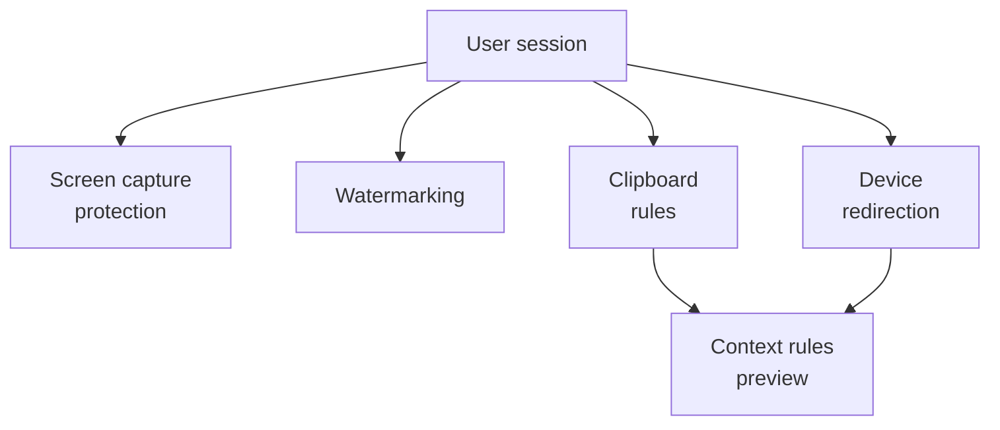

# Session controls

<span class="level l300">Level 300</span>

Session controls decide what the user can see, copy, redirect or expose during a remote session. They are the data-loss prevention layer closest to the user's desktop.

This diagram shows the main control points.



## Screen capture protection

**Status:** Generally available, including support for web connections as of August 2026 [What's new in Azure Virtual Desktop](https://learn.microsoft.com/azure/virtual-desktop/whats-new#august-2026).

Screen capture protection helps prevent sensitive data from being captured on client devices using specific OS features and APIs. Learn says remote content is automatically blocked in screenshots and screen sharing when the feature is enabled [Screen capture protection](https://learn.microsoft.com/azure/virtual-desktop/screen-capture-protection).

!!! warning "Not a DRM boundary"
    Microsoft Learn states that screen capture protection does not provide Digital Rights Management-level protection and is not a substitute for comprehensive data protection [Screen capture protection](https://learn.microsoft.com/azure/virtual-desktop/screen-capture-protection).

## Watermarking

Watermarking adds QR code watermarks to remote desktops. The QR code contains the **Connection ID** or **Device ID** of a remote session, which administrators can use to trace the session [Watermarking](https://learn.microsoft.com/azure/virtual-desktop/watermarking).

Important limitations documented by Learn:

- If watermarking is enabled on a session host, only clients that support watermarking can connect.
- Watermarking is for remote desktops only. With RemoteApp, watermarking is not applied and the connection is allowed.
- Direct connections with **mstsc.exe** do not apply watermarking [Watermarking](https://learn.microsoft.com/azure/virtual-desktop/watermarking).

## Clipboard controls

At the host pool layer, clipboard redirection is controlled by the RDP property **redirectclipboard:i:&lt;value&gt;**. Learn documents **redirectclipboard:i:0** to disable clipboard redirection and **redirectclipboard:i:1** to enable it [Supported RDP properties](https://learn.microsoft.com/azure/virtual-desktop/rdp-properties#redirectclipboard).

The North Star is to keep the host pool setting disabled unless the business case requires copy and paste:

```text
redirectclipboard:i:0
```

If clipboard is required, use Intune Settings Catalog or Group Policy to restrict direction and data types. Learn documents the following Settings Catalog path:

```text
Administrative templates > Windows Components > Remote Desktop Services > Remote Desktop Session Host > Device and Resource Redirection
```

The relevant settings are **Restrict clipboard transfer from server to client**, **Restrict clipboard transfer from client to server**, and the corresponding **(User)** settings. Available options include **Disable clipboard transfers**, **Allow plain text**, **Allow plain text and images**, **Allow plain text, images, and Rich Text Format**, and **Allow plain text, images, Rich Text Format, and HTML** [Clipboard transfer direction](https://learn.microsoft.com/azure/virtual-desktop/clipboard-transfer-direction-data-types).

## Context-based redirections

**Status:** Preview. Context-based redirections are in public preview as of June 2026 [What's new in Azure Virtual Desktop](https://learn.microsoft.com/azure/virtual-desktop/whats-new#june-2026).

!!! info "Preview"
    Use context-based redirections for pilots or tightly scoped high-risk personas until the feature reaches general availability.

Context-based redirection uses Conditional Access authentication context and Azure Virtual Desktop host pool RDP properties to dynamically allow or restrict clipboard, drive, printer and USB redirection based on user and session conditions, such as user role, device compliance or network location [Context-based redirections](https://learn.microsoft.com/azure/virtual-desktop/context-based-redirections-avd).

## Display and input protection previews

**Status:** Preview. Display Protection is in public preview as of September 2026, and Windows Cloud Keyboard Input Protection is in preview as of November 2025 [What's new in Azure Virtual Desktop](https://learn.microsoft.com/azure/virtual-desktop/whats-new#september-2026), [What's new in Azure Virtual Desktop](https://learn.microsoft.com/azure/virtual-desktop/whats-new#november-2025).

!!! info "Preview"
    Do not make Display Protection or Windows Cloud Keyboard Input Protection a hard dependency for a production baseline until they are generally available and validated with the organisation's supported clients.

Display Protection helps protect sensitive content by securing the display path between the session host and supported endpoint devices [Display Protection](https://learn.microsoft.com/windows-365/enterprise/windows-cloud-display-protection). Windows Cloud Keyboard Input Protection encrypts keystrokes at the kernel level to help protect against keylogger malware and endpoint threats [Input protection](https://learn.microsoft.com/windows-365/enterprise/windows-cloud-input-protection).

## Device and resource redirection

Redirection lets a remote session use local resources such as clipboard, webcams, USB devices and printers [Peripheral redirection](https://learn.microsoft.com/azure/virtual-desktop/configure-device-redirections). The security stance is deny by default:

| Resource | RDP property | North Star |
| --- | --- | --- |
| Clipboard | **redirectclipboard:i:&lt;value&gt;** | Disable or restrict by direction and data type. |
| Drives | **drivestoredirect:s:&lt;value&gt;** | Disable unless file transfer is explicitly required. |
| Printers | **redirectprinters:i:&lt;value&gt;** | Disable or restrict to approved personas. |
| COM ports | **redirectcomports:i:&lt;value&gt;** | Disable. |
| Smart cards | **redirectsmartcards:i:&lt;value&gt;** | Enable only where smart card authentication is required. |
| Cameras | **camerastoredirect:s:&lt;value&gt;** | Enable only for Teams or app use cases that need it. |
| Audio capture | **audiocapturemode:i:&lt;value&gt;** | Enable only when microphone use is required. |
| USB devices | **usbdevicestoredirect:s:&lt;value&gt;** | Disable by default. |

RDP property names and syntax are documented in the Azure Virtual Desktop supported RDP properties article [Supported RDP properties](https://learn.microsoft.com/azure/virtual-desktop/rdp-properties).

---

Part of [Security](index.md).
